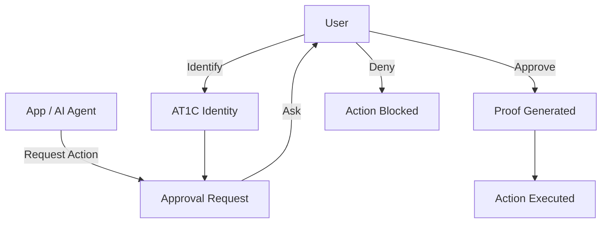

🔐 AT1C Protocol

A verifiable approval layer for human and AI actions

- 📜 **AT1C Protocol (v0.1)**  
  👉 [docs/protocol.md](docs/protocol.md)

- 📄 **Whitepaper**  
  👉 [docs/whitepaper.md](docs/whitepaper.md) 

AT1C introduces a new primitive:

Read the AT1C Protocol Specification:
👉 docs/protocol.md

**Every approval in AT1C can be independently verified—across systems, platforms, and time**

🧠 The Problem

Today’s internet is built on implicit trust:

Apps act on behalf of users silently
AI agents can execute without oversight
Identity is fragmented and platform-controlled

This creates a growing risk:

Automation without accountability

⚡ The AT1C Solution

AT1C adds a simple but powerful control layer:

🔐 User-controlled identity
✋ Explicit approval before any action
🧾 Verifiable proof of consent
🤖 AI agents gated by human intent

AT1C doesn’t replace existing systems — it wraps them with accountability.

🚀 What This Enables
Safe AI agents that cannot act without permission
Consent-based authentication (beyond passwords)
Auditable digital actions (who approved what, when)
A foundation for human-in-the-loop automation
🌍 Why It Matters

As AI becomes autonomous, the question is no longer:

“Can systems act?”

But:

“Who allowed them to act—and can that be proven?”

AT1C answers that.
Early-stage protocol. Core concepts and demos implemented. Actively exploring real-world applications.
---

 🚀 Quick Demo (30 seconds)

Clone and run:

```bash
git clone https://github.com/alwayshuman/at1c.git
cd at1c
npx ts-node --compiler-options '{"module":"CommonJS"}' examples/login-demo/index.ts
```

👉 Try approving and rejecting requests.

---

 🔘 Demo 1 — Sign in with AT1C

Simulates a login flow where:

* user is identified
* approval is requested
* access is granted only after consent

```bash
npx ts-node --compiler-options '{"module":"CommonJS"}' examples/login-demo/index.ts
```

---

 🤖 Demo 2 — AI Agent Approval

Simulates an AI attempting to act:

* AI requests permission
* user approves or denies
* action is controlled by the user

```bash
npx ts-node --compiler-options '{"module":"CommonJS"}' examples/ai-agent-demo/index.ts
```

---

 🧠 Core Concept

AT1C introduces a simple but powerful rule:

> **Nothing acts on behalf of a user without explicit approval**

3. Save + exit Nano
Ctrl + O → Enter

---

 📦 Project Structure

```
at1c/
├── packages/
│   └── sdk/        # Core AT1C client
├── examples/
│   ├── login-demo/
│   └── ai-agent-demo/
├── docs/           # Protocol docs (coming soon)
```

---

 🔮 Vision

AT1C can become the standard layer for:

* AI safety & accountability
* secure identity flows
* permission-based automation
* verifiable digital actions

---

 🤝 Contributing

This project is early-stage and focused on building open, human-first infrastructure for AI systems.

Ideas, feedback, and collaboration are welcome.

---

 📜 License

MIT


